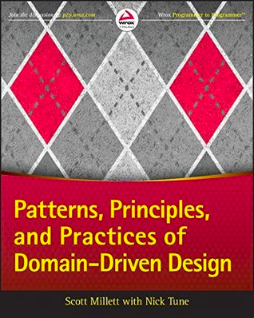

= Principles, Practices and Patterns of Domain-Driven Design
:toc:
:toclevels: 2

Java variant code for the book  https://www.goodreads.com/en/book/show/25531393[Principles, Practices and Patterns of Domain-Driven Design]

The original code is written in `C#`, it is an adoption for `Java`.

== Replacements

Most technologes are replaced with equivalents that are popular in the Java world.

.technologies
|===
|Original |Equivalent | Comment

| ASP.NET | Spring Thymeleaf | See README in CH12
| NServiceBus | RabbitMQ  | See README in CH12
| Mass Transit | Kafka  |  See README in CH12

| ASP.NET | Spring Thymeleaf | See README in CH12
| NServiceBus | RabbitMQ, ApplicationEventPublisher  | See README in CH12 and CH18
| Mass Transit | Kafka  | See README in CH12
| Syndication |  rometools | See README in CH13

| NHibernate | Hibernate | I skipped `fluent-hibernate`, see README in CH15, CH21
| StringExtensions | https://github.com/dehasi/zeliba#TheString[TheString] | Java doesn't support this feature, I used a https://github.com/dehasi/zeliba[ZeLiba].

| SQL Server Express | MySQL, https://www.h2database.com/html/main.html[H2], https://www.sqlite.org/[SQLite] | see README CH21
| StructureMap | I made DI manually a| see README CH21
| EntityFramework | https://www.jooq.org/[JOOQ] with SQLite | see README CH21
| Dapper Micro ORM | https://jdbi.org/[JDBI] with SQLite a| see README CH21
|===

Besides replacement of technologies, there is some language "sugar" to keep code more aligned to the book examples.

.replacements
|===
|Original |Equivalent | Comment

| GUID | UUID | As it's just an example, for this project, there is no difference
| decimal | BigDecimal with https://github.com/dehasi/zeliba#TheComparable[TheComparable] | https://github.com/dehasi/zeliba[ZeLiba] for fluent comparison, as Java doesn't support `>` or `<` for BigDecimal.
| NotImplementedException | own NotImplementedException | see `java-replacements`
| ApplicationException | own ApplicationException | see `java-replacements`
| ArgumentNullException | NullPointerException | usually inside `Objects.requireNonNull`
| InvalidOperationException | own InvalidOperationException | see `java-replacements`
| IEnumerable | Arrays or `List<>` |
|===

== Chapters with Additional Readme

=== Chapter 12
It's a big chapter, and it requires a separate readme.
See link:ch12/README.adoc[] for details.

=== Chapter 13
It's a big chapter, and it requires a separate readme.
See link:ch13/README.adoc[] for details.

=== Chapter 15
This chapter required a bit of work with Hibernate.
See link:ch15/README.adoc[] for details.

=== Chapter 18
This chapter required a bit of work with "Static" `DomainEvents`.
See link:ch18/README.adoc[] for details.

=== Chapter 21
This chapter required a bit of work with ORMs and databases.
See link:ch21/README.adoc[] for details.

== Contributing

Improvements and pull requests are welcome!
Each readme has a ToDon't list.
It's a list of potential improvements, but I won't have time for them. Feel free to check them.
Fixing mistyping in readmes is also welcome!