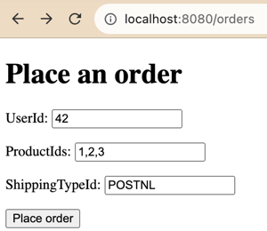

= CH12 Integrating via Messaging
:toc:
:toclevels: 1

In this chapter, the authors build a distributed application, that consists of a few services. They call it an "E‐Commerce Application".
The services communicate with each other via message buses.
The authors use two message platforms: https://github.com/Particular/NServiceBus[NServiceBus] and https://masstransit.io/[Mass Transit].
They use https://dotnet.microsoft.com/en-us/apps/aspnet[ASP.NET] as a web framework.
I'll use https://spring.io/projects/spring-boot[Spring Boot] with https://www.rabbitmq.com/[RabbitMQ] and https://kafka.apache.org/[Kafka] instead.

== Replacements
.replacements
|===
| Original | Replacement | Comment

| ASP.NET | Spring Thymeleaf | JSP also can work
| NServiceBus | `RabbitMQ`  | initially `ApplicationEventPublisher`
| `Mass Transit` | `Kafka`  |
|===

As the original code is written on `C#`, authors use Visual Studio projects. I'll use `Maven`.
And every Visual Studio subproject will be a separate maven module. Each maven module that wants to produce or consume a message
must add a corresponding module with messages classes as a dependency.

The `Maven` modules naming convention is the following `{bounded context}-{messages}` like `sales-message` and
`{bounded context}-{business-component}` like `sales-ordes`. Also, package structure follows `domainName.businessComponent` pattern.
See the project structure.

=== Spring Boot
Spring boot has a built-in web server, which makes it easy to develop a `web` module.
However, other components are console applications in the original. They only listen to events or publish events.
As they don't need a web server, `Spring Boot` is overkill, maybe in the future I'll rewrite them just with `Spring`.

=== Spring Thymeleaf

UI is used only to "place an order" - trigger the process. It's not necessary, I can trigger `web` app via `curl`.
But I try to follow the book structure.
The `web` module provides a simple HTML page. I used https://docs.spring.io/spring-framework/reference/web/webmvc-view/mvc-thymeleaf.html[Spring Thymeleaf]
But I don't need any rendering, so just HTML should work.

=== ApplicationEventPublisher

Spring Framework supports https://docs.spring.io/spring-integration/docs/current/reference/html/event.html[Application Events].
Initially, while I was developing everything in a single module I used `ApplicationEventPublisher` as a message bus.

=== RabbitMQ

Java classes must implement `Serializable` interface to be published in `RabbitMQ`.

I run `RabbitMQ` separately from docker. I use the default settings so far. The default credentials are guest/guest.
`RabbitMQ` management UI is available at http://localhost:15672/.

[source, shell]
----
docker run -d -p 5672:5672 -p 15672:15672 --name my-rabbit rabbitmq:3-management
----

Also, it seems it's not possible to have multi events in one queue. That's why I configured a few queues.
Otherwise, I'm getting an exception.
....
Cannot convert from [sales.messages.commands.PlaceOrder] to [sales.messages.events.OrderCreated]
....

Also, I didn't set up "Second-Level Retries", mentioned in the book.

As `RabbitMQ` does not support multiple consumers for the same message.  That's why I used https://www.baeldung.com/rabbitmq-spring-amqp[fanout] feature for `OrderCreated` event.

=== Kafka

I use kafka from `confluent-local`. See the attached docker compose. I use default settings.
I use JSON deserializer. Jackson can't deserialize without setters by default. That's why `OrderCreated`
in `promotions-lucky-winner` has getters and setters.

== Result Run

Let's run all apps, "place an order" and see logs.

.UI

.shipping
....
Shipping BC storing: Order: {1} User: {42} Shipping Type: {POSTNL} AddressID123
Shipping BC arranged shipping for Order: {1} {42}, Address ID: {AddressID123}
....

.billing
....
Received order created event: OrderId: 1
# exception logs, simulating PaymentProvider failure
# Caused by: java.lang.RuntimeException: Service unavailable. Down for maintenance.

Received order created event: OrderId: 1
# exception logs, simulating PaymentProvider failure
# Caused by: java.lang.RuntimeException: Service unavailable. Down for maintenance.

Received order created event: OrderId: 1
Received payment accepted notification for Order: {1}. Published PaymentAccepted event
....

.sales
....
Created order #{1} : Products:{1,2,3} with shipping: {POSTNL} made by user: {42}
....

.promotions bridge
....
Bridge received order: {1}. About to push it onto Kafka's queue
....

.promotions
....
Kafka handling order placed event: Order: {1} for User: {42}
....

== Application's Diagram

[plantuml]
----
@startuml C4_Elements
!include https://raw.githubusercontent.com/plantuml-stdlib/C4-PlantUML/master/C4_Container.puml
!include https://raw.githubusercontent.com/plantuml-stdlib/C4-PlantUML/master/C4_Component.puml
' ContainerDb(db, "Database", "Microsoft SQL", "Holds product, order and invoice information")
'System(systemAlias, "Label", "Optional Description")

AddRelTag("async", $textColor=$ARROW_FONT_COLOR, $lineColor=$ARROW_COLOR, $lineStyle=DashedLine())

Person(user, "user")

System_Boundary(e_commence, "E‐Commerce") {
    Container(web_app, "Web App", "Spring Boot")
    Container(sales, "Sales", "Spring Boot")
    Container(billing, "Billing", "Spring Boot")
    Container(shipping, "Shipping", "Spring Boot")
    Container(promotions_bridge, "Promotions-Bridge", "Spring Boot")

    ContainerQueue(sales_orders_PlaceOrder, "PlaceOrder", "RabbitMQ")
    ContainerQueue(sales_orders_OrderCreated, "OrderCreated", "RabbitMQ")
    ComponentQueue(billing_local, "RecordPaymentAttempt", "RabbitMQ")
    ContainerQueue(billing_payments_PaymentAccepted, "PaymentAccepted", "RabbitMQ")
    ContainerQueue(shipping_ShippingArranged, "ShippingArranged", "RabbitMQ")
}

System_Boundary(promotions_system, "Promotions") {
    Container(promotions, "Promotions", "Spring Boot")
    ContainerQueue(kafka, "Promotions/PlaceOrder", "Kafka")
}

Rel(user, web_app, "POST /orders/place", "HTTP")
Rel(web_app, sales_orders_PlaceOrder, "Publishes", "Command", $tags="async")

Rel(sales, sales_orders_PlaceOrder, "Consumes", "Command", $tags="async")
Rel(sales, sales_orders_OrderCreated, "Publishes", "Event", $tags="async")

Rel(billing, sales_orders_OrderCreated, "Consumes", "Event", $tags="async")
Rel(billing, billing_local, "Publishes", "Command", $tags="async")
Rel(billing, billing_local, "Consumes", "Command", $tags="async")
Rel(billing, billing_payments_PaymentAccepted, "Publishes", "Event", $tags="async")

Rel(shipping, sales_orders_OrderCreated, "Consumes", "Event", $tags="async")
Rel(shipping, billing_payments_PaymentAccepted, "Consumes", "Event", $tags="async")
Rel(shipping, shipping_ShippingArranged, "Publishes", "Event", $tags="async")

Rel(promotions_bridge, sales_orders_OrderCreated, "Consumes", "Event", $tags="async")
Rel(promotions_bridge, kafka, "Publishes", "Event", $tags="async")
Rel(promotions, kafka, "Consumes", "Event", $tags="async")

SHOW_LEGEND()
footer drawn with PlantUML v. %version() and C4-PlantUML v. C4Version()
@enduml
----

== To Don't List

List of improvements, which nice to do, but I won't spend time on it.
Pull requests are welcome!

* Find a better way to distinguish events and commands in C4 diagram.
* Add RabbitMQ to docker compose.
* Use JSON serializer for RabbitMQ and remove `Serializable`.
* Split code into packages: `application`, `domain`, `infrastructure`, like it's done in https://github.com/elbandit/PPPDDD/tree/master/12%20-%20Integrating%20Via%20Messaging[book examples]
* Use the latest Spring Boot.
* When I updated to Spring Boot 3, logging stopped working. That's why I added exclusions and `slf4j` to `promotions-lucky-winner`. Which is strange and should be investigated.
* Refactor code, fix formatting.
* Applications are just event listeners and don't need a web server. Rewrite them to a console app.
