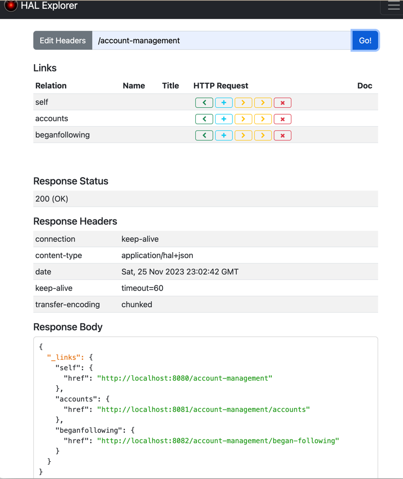
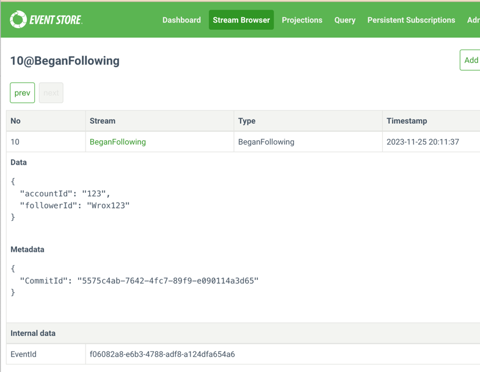

= CH13
:toc:
:toclevels: 2

== SOAP

In the book, the authors use `WCF`.
I'll use `Spring Boot` and `Spring WS Core`.

=== Diagrams

[plantuml]
----
@startuml
!includeurl https://raw.githubusercontent.com/RicardoNiepel/C4-PlantUML/master/C4_Container.puml

title SOAP Interaction

Container(account_management, "Account Management", "Spring Boot")
Container(discovery, "Discovery", "Spring Boot")

Rel(discovery, account_management, "findUsersFollowers", "SOAP")
@enduml
----

=== Problems

There was a problem in the `discovery` module, with generating classes from `wsdl`.
`Jaxb2Marshaller` could not detect generated classes and create a marshaller.
That's why, a call to `account-management` was failing due to `org.springframework.oxm.UncategorizedMappingException: Unknown JAXB exception`.

I assume that the problem is in `episode_xjc.xjb` but I don't want to waste my time for SOAP.
As a quick fix, I generate classes from `xsd`.
You can see a commented maven plugin for generating classes from `wsdl` in `pom.xml`.

=== Examples

`request.xml` is in `/src/test/resources` directory.

.account management
----
$ curl --header "content-type: text/xml" -d @request.xml http://localhost:8080/ws | xmllint --format -
  % Total    % Received % Xferd  Average Speed   Time    Time     Time  Current
                                 Dload  Upload   Total   Spent    Left  Speed
100  2385  100  2061  100   324   141k  22791 --:--:-- --:--:-- --:--:--  332k
<?xml version="1.0"?>
<SOAP-ENV:Envelope xmlns:SOAP-ENV="http://schemas.xmlsoap.org/soap/envelope/">
  <SOAP-ENV:Header/>
  <SOAP-ENV:Body>
    <ns2:findUsersFollowersResponse xmlns:ns2="http://accountmanagement.socialmedia">
      <ns2:follower>
        <ns2:id>follower_0</ns2:id>
        <ns2:name>happy follower 0</ns2:name>
        <ns2:tags>DDD</ns2:tags>
        <ns2:tags>programming</ns2:tags>
        <ns2:tags>Psychology</ns2:tags>
      </ns2:follower>
      <!-- Deleted part -->
      <ns2:follower>
        <ns2:id>follower_9</ns2:id>
        <ns2:name>happy follower 9</ns2:name>
        <ns2:tags>DDD</ns2:tags>
        <ns2:tags>programming</ns2:tags>
        <ns2:tags>Psychology</ns2:tags>
      </ns2:follower>
    </ns2:findUsersFollowersResponse>
  </SOAP-ENV:Body>
</SOAP-ENV:Envelope>
----

.discovery
----
curl --header "content-type: text/xml" -d @request.xml http://localhost:8081/ws | xmllint --format -
  % Total    % Received % Xferd  Average Speed   Time    Time     Time  Current
                                 Dload  Upload   Total   Spent    Left  Speed
100   654  100   336  100   318    984    931 --:--:-- --:--:-- --:--:--  1958
<?xml version="1.0"?>
<SOAP-ENV:Envelope xmlns:SOAP-ENV="http://schemas.xmlsoap.org/soap/envelope/">
  <SOAP-ENV:Header/>
  <SOAP-ENV:Body>
    <ns2:RecommendedUsersResponse xmlns:ns2="http://recommender.discovery">
      <ns2:tags>DDD</ns2:tags>
      <ns2:tags>programming</ns2:tags>
      <ns2:tags>Psychology</ns2:tags>
    </ns2:RecommendedUsersResponse>
  </SOAP-ENV:Body>
</SOAP-ENV:Envelope>
----

== JSON

In the book, the authors use `ASP.NET`.
I'll use `Spring Boot`, again.

=== Diagrams

[plantuml]
----
@startuml
!includeurl https://raw.githubusercontent.com/RicardoNiepel/C4-PlantUML/master/C4_Container.puml

title SOAP Interaction

Container(account_management, "Account Management", "Spring Boot")
Container(discovery, "Discovery", "Spring Boot")

Rel(discovery, account_management, getUsersFollowers", "HTTP/JSON")
@enduml
----

=== Examples

.account management
----
$ curl -v http://localhost:8080/api/followerdirectory/getusersfollowers?accountId=123 | jq
*   Trying 127.0.0.1:8080...
  % Total    % Received % Xferd  Average Speed   Time    Time     Time  Current
                                 Dload  Upload   Total   Spent    Left  Speed
  0     0    0     0    0     0      0      0 --:--:-- --:--:-- --:--:--     0* Connected to localhost (127.0.0.1) port 8080 (#0)
> GET /api/followerdirectory/getusersfollowers?accountId=123 HTTP/1.1
> Host: localhost:8080
> User-Agent: curl/7.86.0
> Accept: */*
>
* Mark bundle as not supporting multiuse
< HTTP/1.1 200
< Content-Type: application/json
< Content-Length: 353
< Date: Fri, 24 Nov 2023 15:15:35 GMT
<
{ [353 bytes data]
100   353  100   353    0     0  41745      0 --:--:-- --:--:-- --:--:--  172k
* Connection #0 to host localhost left intact
[
  {
    "id": "follower_0",
    "name": "happy follower 0",
    "tags": [
      "programming",
      "Psychology",
      "DDD"
    ]
  },
  {
    "id": "follower_3",
    "name": "happy follower 3",
    "tags": [
      "programming",
      "Psychology",
      "DDD"
    ]
  }
]
----

.discovery
----
$ curl -v http://localhost:8081/api/recommender/getrecommendedusers?accountId=123 | jq
*   Trying 127.0.0.1:8081...
  % Total    % Received % Xferd  Average Speed   Time    Time     Time  Current
                                 Dload  Upload   Total   Spent    Left  Speed
  0     0    0     0    0     0      0      0 --:--:-- --:--:-- --:--:--     0* Connected to localhost (127.0.0.1) port 8081 (#0)
> GET /api/recommender/getrecommendedusers?accountId=123 HTTP/1.1
> Host: localhost:8081
> User-Agent: curl/7.86.0
> Accept: */*
>
* Mark bundle as not supporting multiuse
< HTTP/1.1 200
< Content-Type: application/json
< Transfer-Encoding: chunked
< Date: Fri, 24 Nov 2023 15:44:10 GMT
<
{ [40 bytes data]
100    34    0    34    0     0    182      0 --:--:-- --:--:-- --:--:--   188
* Connection #0 to host localhost left intact
[
  "programming",
  "Psychology",
  "DDD"
]
----

== REST

I use kebab-case for URLs.
E.g. `/account-management` instead of `/accountmanagement`.

=== HAL

Instead of `HAL WEB API` I use https://docs.spring.io/spring-hateoas/docs/current/reference/html/#fundamentals.representation-models[Spring HATEOAS].

Instead of https://github.com/mikekelly/hal-browser[mikekelly:hal-browser]
I use https://toedter.github.io/hal-explorer/release/reference-doc/[toedter:hal-explorer].
It's possible to download `mikekelly:hal-browser` and add it as static content to the app.
But I wasn't able to make Spring Boot serve static content, however, it should be very easy.

That's why I added `toedter:hal-explorer` and added a resource handler for `/webjars`.
See https://makandracards.com/spring/47883-hal-browser[].
I run the HAL browser like below.

----
http://localhost:8080/webjars/hal-explorer/1.2.0/index.html
http://localhost:8080/webjars/hal-explorer/1.2.0/index.html#uri=/account-management
----

.hal explorer

I don't want to spend time to create a nice URL.

=== EventStoreDB

I run https://www.eventstore.com/[] from docker.
To enable Stream Browser, add `--enable-atom-pub-over-http`.

.docker-compose.yaml
[source,yaml]
----
include::social-media-rest/docker-compose.yaml[]
----

=== HTTP Atom

I replace `SyndicationItem` with `rometools`. I return the `Feed` object in `BeganFollowingController`.
It seems that `Spring Boot` is smart enough to start supporting Atom out of the box if `rometools` is on the classpath.
So far `GET /began-following` endpoint returns some XML with content-type `application/atom+xml`.

But, I couldn't deserialize `Feed` using `rometools` in the `dicsovery-recommendations` app.

[source, java]
----
SyndFeed syndFeed = new SyndFeedInput().build(new XmlReader(new URL(beganFollowingURL)));
----
`rometools` can deserialize only into `SyndFeed`, `SyndEntry`, etc.
But `SyndEntry` does not have `id`.
I also tried to deserialize XML using `JacksonXmlMapper`, but got the exception below.

....
InvalidDefinitionException: Conflicting setter definitions for property "content": org.jdom2.Element#setContent(org.jdom2.Content) vs org.jdom2.Element#setContent(java.util.Collection)
....

I decided not to spend time fixing it and created `MyFeed` and `MyEntry` classes with only relevant fields.

=== Diagrams

[plantuml]
----
@startuml
!includeurl https://raw.githubusercontent.com/RicardoNiepel/C4-PlantUML/master/C4_Container.puml

title REST Interaction

'Person(user, "user", "description")

Container(accounts_entry_point, "Accounts Entry Point", "Spring Boot")
Container(accounts_api, "Accounts API", "Spring Boot", "")
Container(accounts_regular, "Accounts Regular", "Spring Boot", "")
ContainerDb(event_store, "EventStore", "EventStoreDB", "")
Container(discovery, "Discovery Recommendations", "Spring", "")

Rel(accounts_api, event_store, "Persists", "Event:BeganFollowing")
Rel(accounts_regular, event_store, "Retrieves", "Event:BeganFollowing")
Rel(discovery, accounts_regular, "Retrieves", "HTTP/ATOM")

@enduml
----

=== Examples
I called "Began Following" a few times.
I see the corresponding events in `EventStoreDB` via UI.
I see "processed" events in `discovery-reccommendations` logs.

.start following call
[source,shell]
----
curl -X POST -v http://localhost:8081/account-management/accounts/123/followers \
   -H 'Content-Type: application/json' \
   -d '{"accountId": "Wrox123"}'
----

The result is in the Stream Browser: http://localhost:2113/web/index.html#/streams/BeganFollowing

.began following event

.discovery recommendations logs
----
Processing event: 23 - 515
Processing event: 123 - Wrox123
Processing event: 23 - AAA
No new events to process
No new events to process
Processing event: 23 - SSS
----

== ToDon't List

- Generate classes from WSDL, fix `Jaxb2Marshaller`
- Map HAL Browser to `/browser.html`
- Deserialize `Feed` via a library