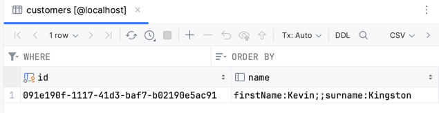

= Value Objects
:toc:

I used `Hibernate` and `H2` database, see `hibernate.cfg.xml`.
I skipped Fluent-Hibernate and wrote mappings in XML, see `test/resources`.

== Denormalized

I didn't find how to persist `UUID` without writing my own converter.
I didn't want to spend much time for it.
I use `String` for ids.

.H2 logs denormalized
----
Hibernate: drop table customers if exists
Hibernate: create table customers (id varchar(255) not null, name varchar(255), primary key (id))
Hibernate: insert into customers (name, id) values (?, ?)
----

.MySQL denormalized

== Normalized

Hibernate requires an ID for every entity.
I failed to work around it. That's why I added a surrogate id `sid` to `Name`.

.H2 logs normalized
[source, log]
----
Hibernate: drop table customers if exists
Hibernate: drop table name if exists

Hibernate: create table customers (id varchar(255) not null, sid varchar(255) not null, primary key (id))
Hibernate: create table name (sid varchar(255) not null, first_name varchar(255), surname varchar(255), primary key (sid))

Hibernate: alter table customers add constraint UK_65vtp5g7g9ikomhrvabcr81fk unique (sid)
Hibernate: alter table customers add constraint FK6r2b8nkjwwg9lrr3ho1umtt9g foreign key (sid) references name

Hibernate: insert into name (first_name, surname, sid) values (?, ?, ?)
Hibernate: insert into customers (sid, id) values (?, ?)

Hibernate: select name0_.sid as sid1_1_, name0_.first_name as first_na2_1_, name0_.surname as surname3_1_ from name name0_
----

.MySQL normalized

== Docker
To get screenshots, I used MySQL, see `hibernate-mysql.cfg.xml`.
I run MySQL from the image below.

[source, yaml]
----
include::assets/docker-compose.yaml[]
----

== ToDont List

* [ ] Use `UUID` for ids
* [ ] Avoid using a surrogate id for "normalized" example