= CH-21 Repositories
:toc:

== Replacements

.replacements

|===
|Original |Equivalent | Comment
| SQL Server Express | MySQL, H2, https://www.sqlite.org/[SQLite] |
| NHibernate | Hibernate 6 with MySQL |
| StructureMap | I made DI manually a| See `Bootstrapper`
| EntityFramework | https://www.jooq.org/[JOOQ] with SQLite | Not sure if it's the equivalent, but it's popular, that's why I decided to try it.
| Dapper Micro ORM | https://jdbi.org/[JDBI] with SQLite a| can also be `Spring JDBC Template`
|===

== Hibernate

I use `Hibernate 6`. It requires `jakarta.xml.bind-api` and `jaxb-runtime`.
I use `H2` in-memory database. For screenshots, I switched to `MySQL 8`.

=== Problems

==== UUID is not supported
Hibernate doesn't automatically support `UUID` type, so I added my own converter and id-generator.
See  `UuidConverter` and  `CustomUuidGenerator`.

==== Generics are not supported o_O
Hibernate doesn't support generic values, which is strange.
I made `id` in `Entity` as `UUID` instead of a generic type.

==== ResultTransformer weird behavior
`ResultTransformer` requires a constructor, that has params names with UPPER_CASE, which is strange.
But I don't want to spend time fixing it.

=== Schema

I used `hbm2ddl.auto=create-drop`  property to automatically create tables. You can create tables manually using SQL dump below:

.mysql dump
[source, sql]
----
include::assets/hibernate/schema.sql[]
----

=== Screenshots
To get screenshots, I used MySQL 8, see `hibernate-mysql.cfg.xml`.
I run MySQL from the docker image below.

.docker-compose.yaml
[source, yaml]
----
include::assets/docker-compose.yaml[tags=header;mysql]
----

.schema
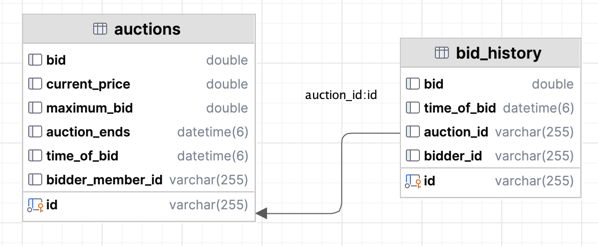
.auctions
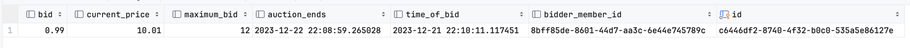
.bid_history
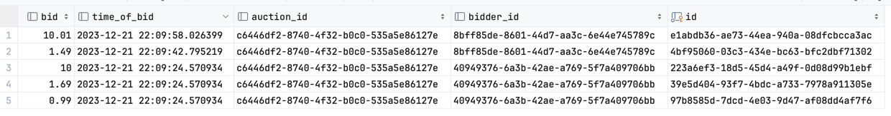

=== Result Run
See `Program`. I run from IDEA.
That's why I'm getting `Cannot invoke "java.io.Console.readLine()"`.
To solve it, I use either `Console.readLine()` or `Threads.sleep()`, see `readLine()` implementation in `Program`.

.application run
----
Time Remaining: PT-23H-59M-57.874842S

Bids..
Ted	 - 1.69	 at 2023-12-20T22:29:33.534634
Rob	 - 1.49	 at 2023-12-20T22:29:35.613081
Ted	 - 0.99	 at 2023-12-20T22:29:33.534634
------------------------------

Hit any key to continue
No Of Bids: 5
Current Bid: 10.01
Winning Bidder: Rob
Time Remaining: PT-23H-59M-55.862047S

Bids..
Rob	 - 10.01	 at 2023-12-20T22:29:37.626320
Ted	 - 10.0	 at 2023-12-20T22:29:33.534634
Ted	 - 1.69	 at 2023-12-20T22:29:33.534634
Rob	 - 1.49	 at 2023-12-20T22:29:35.613081
Ted	 - 0.99	 at 2023-12-20T22:29:33.534634
------------------------------
----

== Raven DB

I use `Raven DB` version `6.0.1`. `Raven DB` has https://ravendb.net/features/clients/java[Java Client].
Java Client requires https://github.com/FasterXML/jackson[jackson] dependencies.
I run `Raven DB` from docker.

.docker-compose.yaml
[source, yaml]
----
include::assets/docker-compose.yaml[tags=header;ravendb]
----

=== Problems

==== `Raven DB` can't work with java UUID

.exception
----
Cannot set identity value 'auctions/33-A' on field class java.util.UUID because field type is not string.
----

I read the post from Oren Eini https://ayende.com/blog/188257-B/avoiding-non-string-identifiers-in-ravendb[Avoiding non string identifiers in RavenDB]
and switched to `String`.

==== Jackson Core
Java client requires https://github.com/FasterXML/jackson-core[jackson-core] to work with Java 8 `LocalDateTime`.

----
Exception in thread "main" java.lang.IllegalArgumentException: Java 8 date/time type `java.time.LocalDateTime` not supported by default: add Module "com.fasterxml.jackson.datatype:jackson-datatype-jsr310" to enable handling (through reference chain: ravendbexample.model.auction.Auction["endsAt"])
----

.jackson-core should fix
----
Exception in thread "main" java.lang.NoClassDefFoundError: com/fasterxml/jackson/core/exc/StreamConstraintsException
----

==== Mistypes in the Book
The method `hasBeenBidOn` should check if `winningBid` is _not_ null.

[source, java]
----
class Auction {

    public boolean hasBeenBidOn() {
        return winningBid != null; //  in the book it's ==
    }

}
----

=== Indexes

As I use Java Client, the query language for indexes is different that it was in the book.
See `BidHistory_NumberOfBids`

.both variants to create indexes work
[source, java]
----
// variant one
BidHistory_NumberOfBids index = new BidHistory_NumberOfBids();
index.execute(documentStore);

// variant two
IndexCreation.createIndexes(List.of(new BidHistory_NumberOfBids()), documentStore);
----

=== Screenshots

.documents
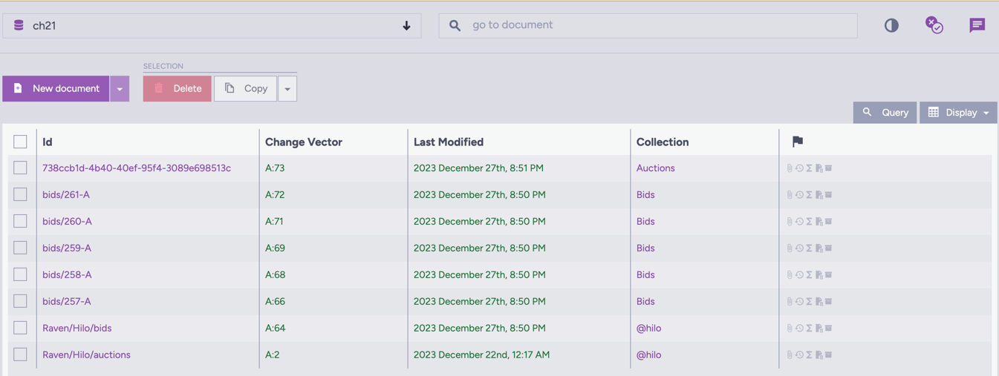
.auctions
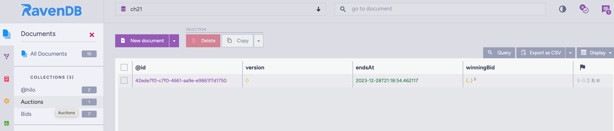
.auction
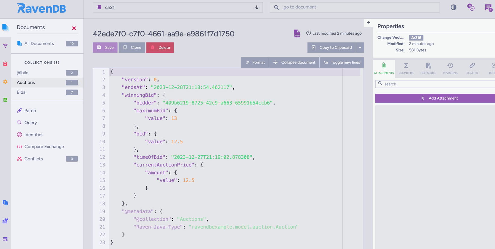
.bids
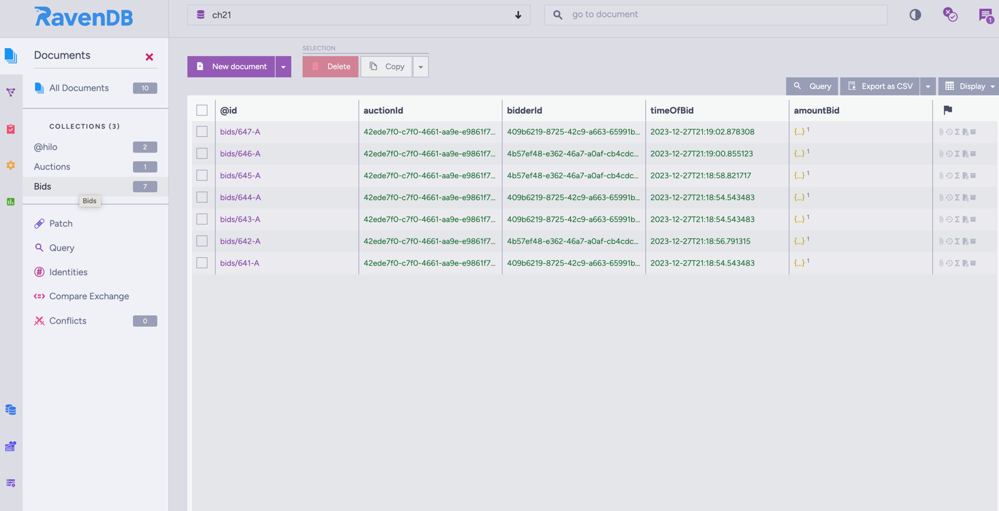
.bid
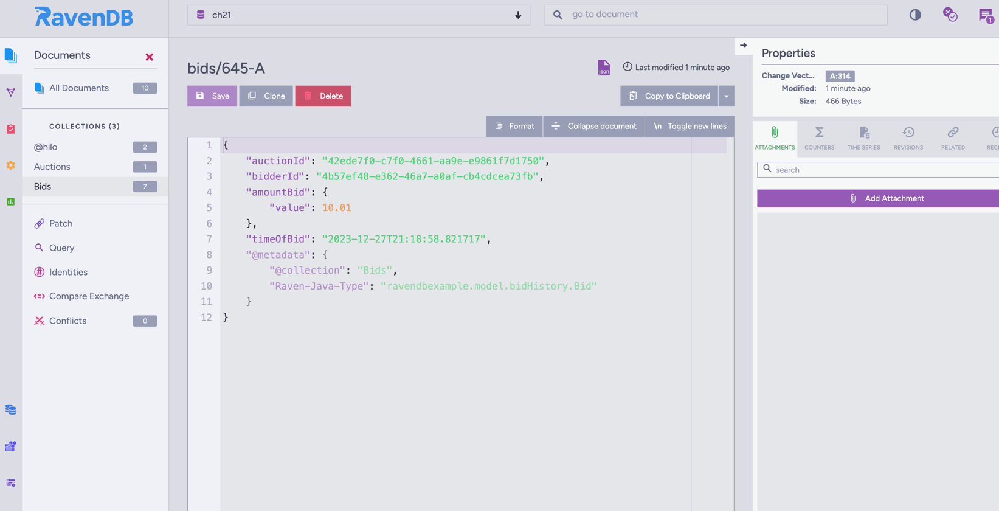

.indexes
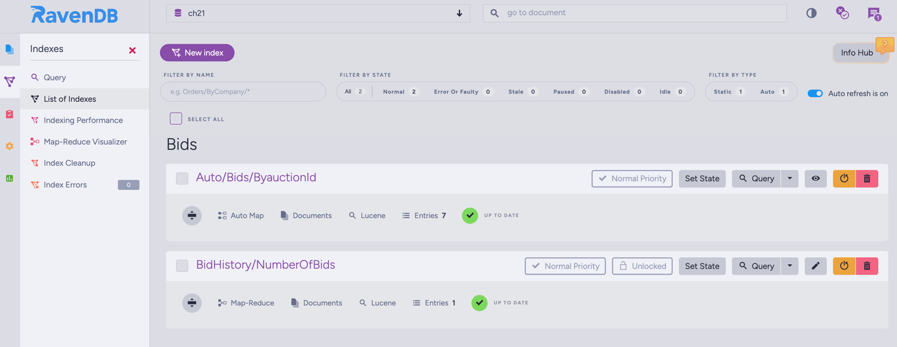

.map-reduce visualization
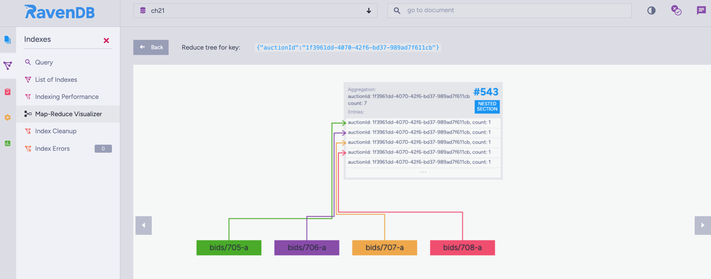

=== Result Run
See `ProgramRavenDB`.

.RavenDB logs
----
Hit any key to continue
Dec 27, 2023 9:12:13 PM net.ravendb.client.documents.session.operations.QueryOperation logQuery
INFO: Executing query from index 'BidHistory/NumberOfBids' where auctionId = $p0 limit $p1, $p2 on index BidHistory/NumberOfBids in http://localhost:8080 (DB: ch21);ch21
Dec 27, 2023 9:12:13 PM net.ravendb.client.documents.session.operations.QueryOperation saveQueryResult
INFO: Query from index 'BidHistory/NumberOfBids' where auctionId = $p0 limit $p1, $p2 (parameters: p0 = 91267d8f-0c4f-493d-82a9-1dc1e5c4b597, p1 = 0, p2 = 1) returned 1 results (total index results: 1)
Dec 27, 2023 9:12:13 PM net.ravendb.client.documents.session.operations.QueryOperation logQuery
INFO: Executing query from 'Bids' where auctionId = $p0 on index null in http://localhost:8080 (DB: ch21);ch21
Dec 27, 2023 9:12:13 PM net.ravendb.client.documents.session.operations.QueryOperation saveQueryResult
INFO: Query from 'Bids' where auctionId = $p0 (parameters: p0 = 91267d8f-0c4f-493d-82a9-1dc1e5c4b597) returned 7 results (total index results: 7)
----

.application run
----
No Of Bids: 7
Current Bid: 12.5
Winning Bidder: Ted
Time Remaining: PT-23H-59M-51.698101S

Bids..
Ted	 - 0.99	 at 2023-12-27T21:12:04.789875
Rob	 - 1.49	 at 2023-12-27T21:12:06.938750
Ted	 - 1.69	 at 2023-12-27T21:12:04.789875
Ted	 - 10.0	 at 2023-12-27T21:12:04.789875
Rob	 - 10.01	 at 2023-12-27T21:12:08.979549
Rob	 - 12.0	 at 2023-12-27T21:12:11.008526
Ted	 - 12.5	 at 2023-12-27T21:12:13.031121
------------------------------
----

== JOOQ
I use `SQLite`.
JOOQ generates  DB Context, DTOs and mappings for DTOs.
DTOs has suffix `Record` and it seems it implements `ActiveRecord` pattern.
In production, generated code stays in `target/generated-sources/packeage.name`.
In this project I put the generated code to `src/main/sqliteexample/infrastructure/jooq` only for demonstration purpose.

If you want to regenerate it, delete `<skip>true</skip>`
in `jooq-codegen-maven` plugin.

=== Problems

==== Transactions
`DSLContext` has methods like `startTransaction` and `commit`, but
it's not clear for me if I use them correctly.

=== Schema
Schema is the same as for Hibernate part.

.schema
[source, sql]
----
include::assets/jooq/schema.sql[]
----

=== Screenshots

.schema
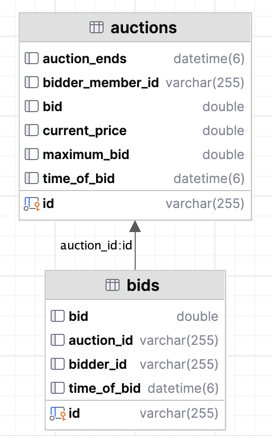
.auctions
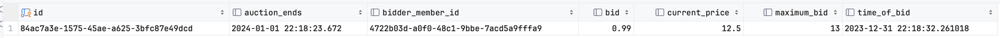
.bids
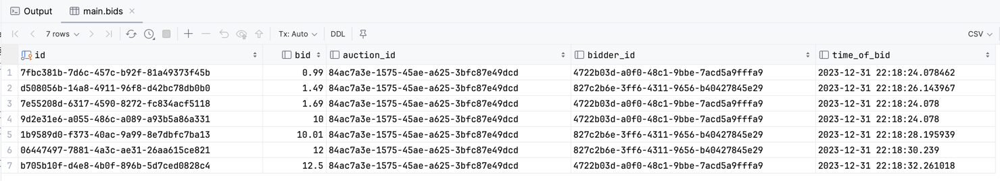

=== Result Run
See `JOOQProgram`. You have to pass a path to DB via program arguments.

.application run
----
------------------------------

Hit any key to continue
No Of Bids: 7
Current Bid: 12.5
Winning Bidder: Ted
Time Remaining: PT-23H-59M-51.367706S

Bids..
Ted	 - 0.99	 at 2023-12-31T22:12:36.524
Rob	 - 1.49	 at 2023-12-31T22:12:38.595
Ted	 - 1.69	 at 2023-12-31T22:12:36.524
Ted	 - 10.0	 at 2023-12-31T22:12:36.524
Rob	 - 10.01	 at 2023-12-31T22:12:40.629
Rob	 - 12.0	 at 2023-12-31T22:12:42.667
Ted	 - 12.5	 at 2023-12-31T22:12:44.690
------------------------------
----

== JDBI
I use `SQLite`.

=== Problems

==== Manual mapping
`JDBI` needs mappers for DTOs. See `jdbiexample.infrastructure.mapper`.

==== Transactions in Unit of Work
In the book, the authors use `System.Configuration` to obtain a connection to a database.
`UnitOfWork` uses `System.Transactions` for managing transactions.
My understanding is that `UnitOfWork` wraps a connection via transaction.
When a repository uses the connection, the transaction is already started.

In my case, JBDI manages everything.
I don't have `System.Something` support, and I don't want to have a hidden dependency in my repositories.
That's why I prefer to inject a connection via DI.

I created a class `System` and put `JBDI` there. See `jdbiexample.infrastructure.System`.
`System` manages connections and transactions. I injected `System` into `UnitOfWork` and repositories.
`UnitOfWork` opens transactions via `System.beginTransaction`, repositories use `System.inTransaction`
when persisting within `UnitOfWork` or just `System.handler` when don't. See implementation.

=== Schema

[source, sql]
----
include::assets/jdbi/schema.sql[]
----
=== Screenshots

.schema
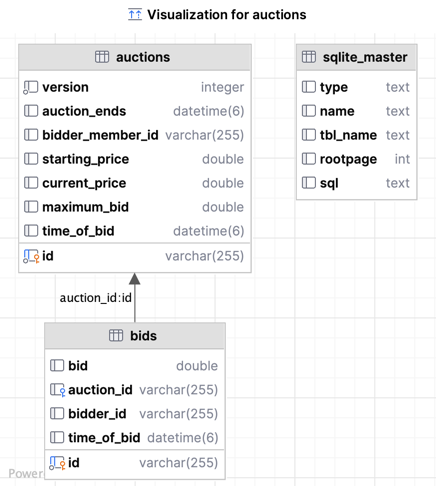
.auctions
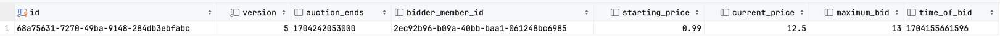
.bids
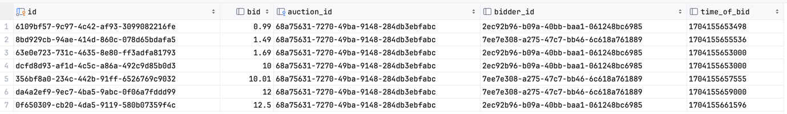

=== Result Run
See `JDBIProgram`. You have to pass a path to DB via program arguments.

.application run
----
Hit any key to continue
No Of Bids: 7
Current Bid: 12.5
Winning Bidder: Ted
Time Remaining: PT-23H-59M-51.393068S

Bids..
Ted	 - 0.99	 at 2024-01-02T01:34:13
Rob	 - 1.49	 at 2024-01-02T01:34:15
Ted	 - 1.69	 at 2024-01-02T01:34:13
Ted	 - 10.0	 at 2024-01-02T01:34:13
Rob	 - 10.01	 at 2024-01-02T01:34:17
Rob	 - 12.0	 at 2024-01-02T01:34:19
Ted	 - 12.5	 at 2024-01-02T01:34:21
------------------------------
----

== ToDont List

* [ ] Use `BigDecimal` for `Money` instead of `double`
* [ ] Format `Duration` and `Money` while printing in `Program`
* [ ] Use `version` for `Entity`
* [ ] Hibernate:Find how to use generics in Entities
* [ ] Hibernate: Use `TupleTransformer` instead of `ResultTransformer`
* [ ] Hibernate: Try to use `record` for entities
* [ ] RavenDB: Figure out why `Bids` collection has "Bids/" prefix, but `Auctions` collection doesn't have "Auctions/" prefix
* [ ] RavenDB: Use `record` instead of POJOs
* [ ] RavenDB: Try MongoDB instead
* [ ] JOOQ: Make sure that transactions work
* [ ] JDBI: Maybe there is a better implementation of `UnitOfWork`
