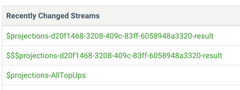

= CH-22 Event Sourcing
:toc:

== RavenDB

I ran `RavenDB` from docker. I need to  manually create a database.

[source,yaml]
----
include::assets/docker-compose.yaml[tags=header;ravendb]
----

=== Screenshots

Screenshots from the application run.

.stream was created

.AccountCreated event

.PhoneCallCharged event (first time)

.CreditSatisfiesFreeCallAllowanceOffer event

.CreditAdded event

.PhoneCallCharged event (second time)

.all events after the application run

=== Result Run

See `ESRavenProgram`

.application logs
----
Create account # this leads to AccountCreated event

Record call # this leads to PhoneCallCharged event

Top up credit # this leads to CreditSatisfiesFreeCallAllowanceOffer and  CreditAdded events

Press any key to continue...
Record call # this leads to PhoneCallCharged event
----

== SQLite

=== Problems

==== Jackson `LocalDateTime` support
The exception:
----
Caused by: com.fasterxml.jackson.databind.exc.InvalidDefinitionException: Java 8 date/time type `java.time.LocalDateTime` not supported by default: add Module "com.fasterxml.jackson.datatype:jackson-datatype-jsr310" to enable handling (through reference chain: sqliteeventstore.model.PayAsYouGo.PhoneCallCharged["phoneCall"]->sqliteeventstore.model.PayAsYouGo.PhoneCall["callStart"])
----

Fixed by registering the module.
----
objectMapper.registerModule(new JavaTimeModule());
----

==== Jackson tries tp deserialize Domain methods

In `PhoneNumber`, Jackson tried to deserialize boolean checks e.g. `isUKLandlineOrMobile`.
However, it's not a field.
Adding `JsonIgnore` solves the problem.
But it brings a bit of infrastructure into the model.

==== Jackson serialization/deserialization

Jackson needs no-arg constructors, getters and setters.
Which makes classes a bit of boilerplate-ish.

==== Maintaining versions

`RavenDB` works as `UnitOfWork` and tracks changes of aggregates.
Here I don't use `UnitOfWork` pattern, that's why I "manually" update `event_sources` table.
See `EventStore.appendEventsToStream`.

=== Schema

I use `SQLite`, the schema is below.

[source,sql]
----
include::assets/sqlite/schema.sql[]
----

=== Screenshots

Screenshots from the application run.
There are almost the same as for `RavenDB`.
I keep them just to demonstrate that the application works.

.stream was created

.AccountCreated event

.PhoneCallCharged event (first time)

.CreditSatisfiesFreeCallAllowanceOffer and CreditAdded events

.PhoneCallCharged event (second time)

.stream version after the application run

=== Result Run
See `EsSqliteProgram`

.application logs
----
Create account # this leads to AccountCreated event

Record call # this leads to PhoneCallCharged event

Top up credit # this leads to CreditSatisfiesFreeCallAllowanceOffer and  CreditAdded events

Press any key to continue...
Record call # this leads to PhoneCallCharged event
----

== EventStoreDB
By default `EventStoreDB` is non-blocking. Each call returns `CompletableFuture`.
I used "blocking" calls. To achieve that, I added a helper method that waits for completions.
See `EventStoreD.await`.

I run `EventStoreDB` from docker.
[source,yaml]
----
include::assets/docker-compose.yaml[tags=header;eventstoredb]
----

=== Problems

==== Integer Overloading

In `EventStore.getStream`, we calculate `amount`.
It can lead to integer overload.

[source,java]
----
@Override public List<DomainEvent> getStream(String streamName, int fromVersion, int toVersion) {
  // if fromVersion = 0, toVersion = Integer.MAX_VALUE
  // we have interger overload
  var amount = (toVersion - fromVersion) + 1;
}
----

==== Getting the end of a stream
`ReadStreamOptions.get().fromEnd()` leads to the exception below.

.exception
----
java.lang.RuntimeException: java.util.concurrent.ExecutionException: io.grpc.StatusRuntimeException: UNKNOWN: Unexpected ReadStreamResult: Error
----

`ReadStreamOptions.get().fromEnd().backwards()` works.

==== Different ObjectMappers
`EventStoreDB` creates `ObjectMapper` ad hoc, that's why I can't even register a module.

.com.eventstore.dbclient.EventDataBuilder
[source, java]
----
public static <A> EventDataBuilder json(UUID id, String eventType, A eventData) {
    try {
        JsonMapper mapper = new JsonMapper(); // <--- HERE
        return json(id, eventType, mapper.writeValueAsBytes(eventData));
    } catch (JsonProcessingException e) {
        throw new RuntimeException(e);
    }
}
----

E.g. I can't use `LocalDateTime`, because this mapper doesn't have `jackson-datatype-jsr310` module.
And I can't add it.

.I can't register module
----
Caused by: com.fasterxml.jackson.databind.exc.InvalidDefinitionException: Java 8 date/time type `java.time.LocalDateTime` not supported by default: add Module "com.fasterxml.jackson.datatype:jackson-datatype-jsr310" to enable handling (through reference chain: sqliteeventstore.model.PayAsYouGo.PhoneCallCharged["phoneCall"]->sqliteeventstore.model.PayAsYouGo.PhoneCall["callStart"])
----

I switched `LocalDateTime` to `String`.

When we save, we serialize data with `ObjectMapper`, that "embedded" into `EventStoreDB`.
When we load, we deserialize data with own `ObjectMapper`. Data is serialized and deserialized by different `ObjectMapper`.
It's not good.

=== Screenshots

We start from a clean `EventStoreDB`.

.clean eventstore

Then we create a steam  and the first event

.stream created

.AccountCreated event

.AccountCreated event data

.PhoneCallCharged event

.PhoneCallCharged event data

Top up account leads to two events: `CreditSatisfiesFreeCallAllowanceOffer` and `CreditAdded`.

.top up account

.CreditSatisfiesFreeCallAllowanceOffer event data

.CreditAdded event data

The last phone call

.PhoneCallCharged event

.PhoneCallCharged event data

=== Result Run
See `ESDBProgram`. But in logs, there is nothing interesting. Most interesting is screenshots.

.application logs
----
Create account

Record call

Top up credit

Press any key to continue...
Record call
----

== Running Queries on EventStoreDB

I do it on empty `EventStoreDB`.
To populate data in `EventStoreDB`, run `ImportTestData`.

=== Problems
==== Money Calculations
I was getting `MoreThanTwoDecimalPlacesInMoneyValueException` while importing data.
I think it's because numbers in `ImportTestData` and because of usage of `double`.
To save time, I deleted this check.

==== Inheritance
`FreePhoneCallCosting` extends `PhoneCallCosting`.
`PhoneCallCosting` was a `record` but to make this inheritance I converted it to `class`.

==== Querying categories
Queries `fromCategory` didn't return anything at all.
I found a similar problem on https://stackoverflow.com/a/47535755/4337151[StackOverflow].
I went to: Projections -> `$by_category` -> Press "Start". It helped.

==== Emit is not allowed
It wasn't clear how to create projections. I was getting the
----
'emit' is not allowed by the projection/configuration/mode
----
error message many times. Eventually I figured out. See screenshots in the chapters below.

=== Screenshots
.populate data

==== Total minutes for a Day for a Customer

.query
[source, javascript]
----
fromStream('{PayAsYouGoAccount}-{a1af9c2612e248529c5ea73ab196e46d}')
.when({
    // initialize the state
    $init : function(s,e) {
        return {
            minutes : 0
        }
    },
    "eventstoredb.model.PayAsYouGo.PhoneCallCharged" : function(s,e) {
        var dateOfCall = e.data.phoneCall.callStart;
        var june4th = '2014-06-04';
        if (dateOfCall.substring(0, 10) === june4th) {
            s.minutes += e.data.phoneCall.minutes.number;
        }
    }
 });
----
.result

==== Minutes per Day for a Customer

.query
[source, javascript]
----
fromStream('{PayAsYouGoAccount}-{a9b540ef309d49fd987bb05cb31634a6}')
.when({
        // initialize the state
        $init : function(s,e) {
            return {
                june3rd: 0,
                june4th: 0,
                june5th: 0
            }
        },
         "eventstoredb.model.PayAsYouGo.PhoneCallCharged" : function(s,e) {

            const dateOfCall = e.data.phoneCall.callStart;
            const june3rd = '2014-06-03';
            const june4th = '2014-06-04';
            const june5th = '2014-06-05';

            if (dateOfCall.substring(0, 10) == june3rd) {
                s.june3rd += e.data.phoneCall.minutes.number
            }
            if (dateOfCall.substring(0, 10) == june4th) {
                s.june4th += e.data.phoneCall.minutes.number
            }
            if (dateOfCall.substring(0, 10) == june5th) {
                s.june5th += e.data.phoneCall.minutes.number
            }
        }
 // handle other types of event and update the state accordingly
});
----

.result

==== Minutes per Day for All Customers

.query
[source, javascript]
----
fromCategory('{PayAsYouGoAccount}')
.when({
    // initialize the state
    $init : function(s,e) {
        return {
            june3rd: 0,
            june4th: 0,
            june5th: 0
        }
    },
    "eventstoredb.model.PayAsYouGo.PhoneCallCharged" : function(s,e) {
        const dateOfCall = e.data.phoneCall.callStart;
        const june3rd = '2014-06-03';
        const june4th = '2014-06-04';
        const june5th = '2014-06-05';

        if (dateOfCall.substring(0, 10) == june3rd) {
            s.june3rd += e.data.phoneCall.minutes.number;
        }
        if (dateOfCall.substring(0, 10) == june4th) {
            s.june4th += e.data.phoneCall.minutes.number;
        }
        if (dateOfCall.substring(0, 10) == june5th) {
            s.june5th += e.data.phoneCall.minutes.number;
        }
    }
// handle other types of event and update the state accordingly
});
----

.result

==== Create a Projection

Go to Projections -> New Projection.

.projection query
[source, javascript]
----
fromCategory('{PayAsYouGoAccount}')
.when({
    "eventstoredb.model.PayAsYouGo.CreditAdded": function(s, event) {
        linkTo('AllTopUps', event);
    }
});
----

.create projection UI

After pressing "Create", you will be redirected to projection details page.

.projection details

you can also see the projection in streams

.our projection

we can explore the projection.

.projection is a stream

.projection event data

And we can query projections

.query from projection
[source, javascript]
----
fromStream('$projections-AllTopUps')
.when({
     $init : function(state, event) {
        return {
            count: 0
        };
    },
    $any: function(state, event) {
        state.count += 1;
    }
});
----

.result

== ToDon't List

* [ ] RavenDB: write tests for snapshot logic
* [ ] SQLite: write tests for snapshot logic
* [ ] SQLite: add `UnitOfWork`
* [ ] SQLite: add transactions
* [ ] Try `MongoDB` as eventstore
* [ ] Try `Kafka` as eventstore
* [ ] Try https://martendb.io/[MartenDB] as eventstore
