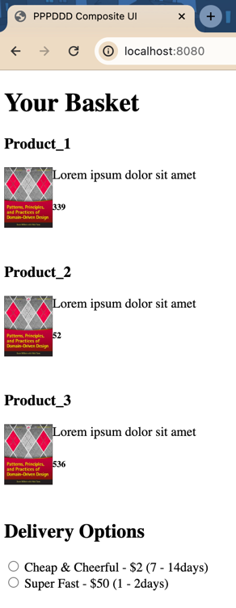

= CH-23 Architecting Application User Interfaces
:toc:

== Replacements

.replacements
|===
|Original |Equivalent | Comment
| ASP.NET | Spring Boot + Thymeleaf |
|===

== Non Distributed

I use `ThymeLeaf`.

=== Problems
==== RenderAction

I don't know the exact replacement for `RenderAction`.

----
@{ Html.RenderAction("ItemInBasket", "CatalogBoundedContext", new { productId = pid}); }
----

`ThymeLeaf` can insert fragment of HTML. But I couldn't figure out how to pass data there.
[source, html]
----
<!-- inserts fragment.html -->

----

My workaround is to explicitly call Java code.

----

----

=== Result Run
I replaced the image and use a local one instead of going to the internet.

== Distributed

=== Result Run

