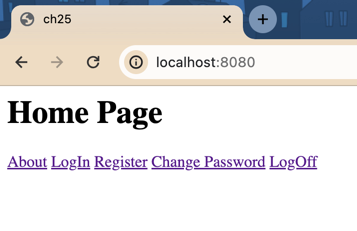
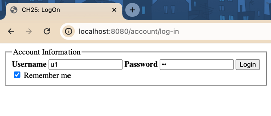

= CH-25 Commands: Application Service Patterns for Processing Business Use Cases
:toc:

== Replacements

.replacements
|===
|Original |Equivalent | Comment
| NHibernate | HashMap based in-memory repository |
| ASP.NET | Spring Boot + Thymeleaf |
|===

== Command Handler Application
I decided not to use `Hibernate` or `SpringData`.
Because persistence is not important for this part.
That's why I implemented all repositories using `HashMap`, see i.e. `HashMapPromotionsRepository`.

For publishing and handling events I could use `ApplicationEventPublisher`,
but for simplicity I used `DomainEvents` class.

For command handling I implemented my own "framework", see `framework` package.

To check that it works, I wrote a test for one command handler, see `ApiTest`.

== Command Handler Presentation
I didn't use `Spring Security`.
But this part is more and application services, like validators, than security.

=== Validators
Spring uses some validators our of the box, like `@NotBlank`.
For passwords check I add two custom validators: `@Password` and `@FieldsMatch`, see `models.validators`.

=== ScreenShots

.homepage

.login form

== Gambling

In `applicationServices`, instead of a real libraries, I used interfaces that mimic them.
See `applicationServices.utils`.

== ToDon't List

* [ ] Add Unit Test for Command Handlers
* [ ] Use `Spring Security`