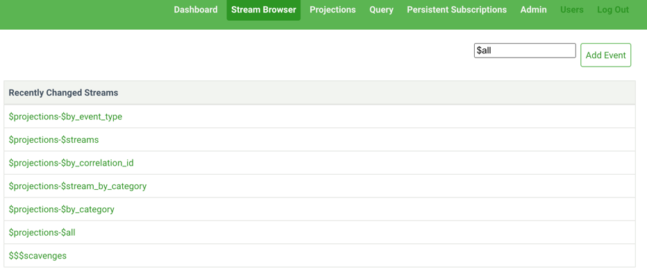
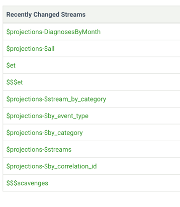
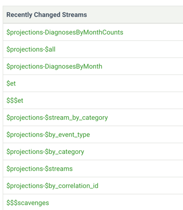
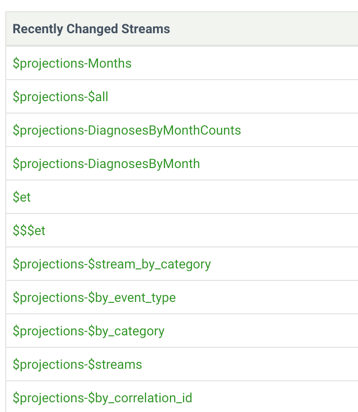
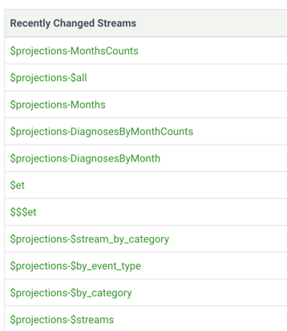
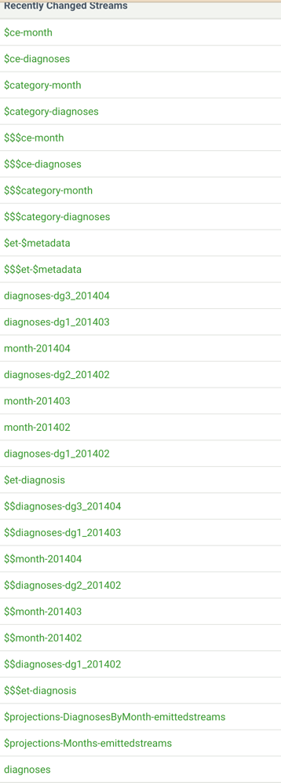
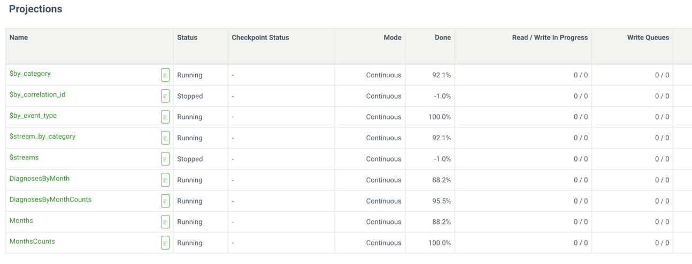
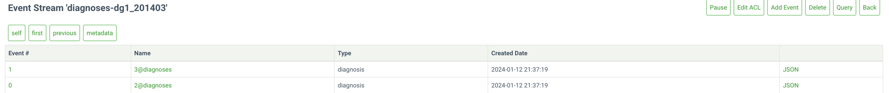
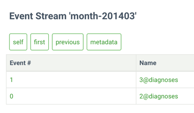
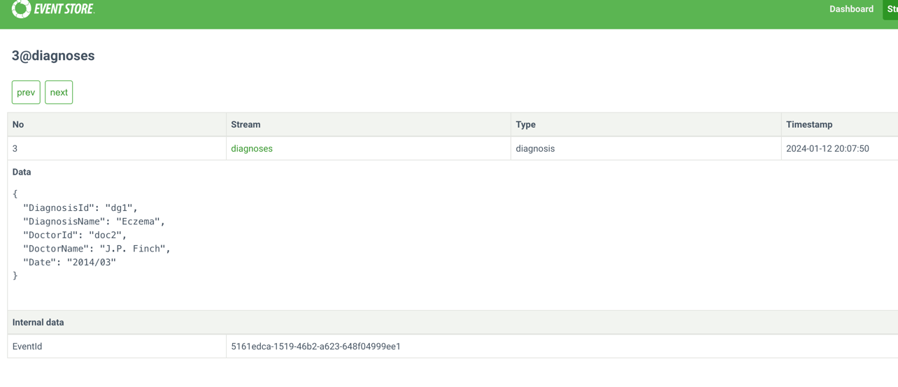

= CH-26 Queries: Domain Reporting
:toc:

In this chapter, I use unit-tests instead of adding UI.

== Replacements

.replacements
|===
|Original |Equivalent | Comment
| System.Data.SqlClient | `Spring NamedParameterJdbcTemplate` |
| SQL Server Express | H2  |
|===

== Dealership Domain
To make it work, I made a dummy implementation of interfaces.
I use `H2` database and `MockMvc` to perform requests and assertions.
Test data and schema are in `test/resources/data.sql` and `test/resources/schema.sql`.

=== Result Run
See `DealershipPerformanceReportControllerTest`.

.mockMvc test
----
MockHttpServletRequest:
      HTTP Method = GET
      Request URI = /dealership-performance-report
       Parameters = {ids=[1,2,3], start=[2023-12-12], end=[2024-12-12]}
          Headers = []
             Body = null
    Session Attrs = {}

Handler:
             Type = ch26reporting.application.dealiership.controller.DealershipPerformanceReportController
           Method = ch26reporting.application.dealiership.controller.DealershipPerformanceReportController#index(List, LocalDate, LocalDate)

MockHttpServletResponse:
           Status = 200
    Error message = null
          Headers = [Content-Type:"application/json"]
     Content type = application/json
             Body = {"ReportStartDate":"2023-12-12","ReportEndDate":"2024-12-12","Dealerships":[{"DealershipName":"dealership1","TotalRevenue":25,"TargetRevenue":12,"NetProfit":52,"TargetProfit":14},{"DealershipName":"dealership2","TotalRevenue":25,"TargetRevenue":12,"NetProfit":52,"TargetProfit":14},{"DealershipName":"dealership3","TotalRevenue":25,"TargetRevenue":12,"NetProfit":52,"TargetProfit":14}]}
----

See `DealershipReportUsingMediatorControllerTest`.

.mockMvc test
----
MockHttpServletRequest:
      HTTP Method = GET
      Request URI = /dealership-report-using-mediator
       Parameters = {ids=[1,2,3], start=[2023-12-12], end=[2024-12-12]}
          Headers = [Content-Type:"application/json;charset=UTF-8"]
             Body = null
    Session Attrs = {}

Handler:
             Type = ch26reporting.application.controllers.DealershipReportUsingMediatorController
           Method = ch26reporting.application.controllers.DealershipReportUsingMediatorController#index(List, LocalDate, LocalDate)

MockHttpServletResponse:
           Status = 200
    Error message = null
          Headers = [Content-Type:"application/json"]
     Content type = application/json
             Body = {"ReportStartDate":"2023-12-12","ReportEndDate":"2024-12-12","Dealerships":[{"DealershipName":null,"TotalRevenue":1212,"TargetRevenue":0,"NetProfit":1212,"TargetProfit":200},{"DealershipName":null,"TotalRevenue":1212,"TargetRevenue":0,"NetProfit":1212,"TargetProfit":200},{"DealershipName":null,"TotalRevenue":1212,"TargetRevenue":0,"NetProfit":1212,"TargetProfit":200}]}
----

== Loyalty Domain
I use the same setup as for "Dealership" domain.
I updated SQL query for calculating `purchases` otherwise it returned `0`.

=== Result Run

See `LoyaltyReportQueryingDatastoreControllerTest`.

.mockMvc test
----
MockHttpServletRequest:
      HTTP Method = GET
      Request URI = /loyalty-report-querying-datastore
       Parameters = {start=[2023-02-01], end=[2024-12-12]}
          Headers = []
             Body = null
    Session Attrs = {}

Handler:
             Type = ch26reporting.application.controllers.LoyaltyReportQueryingDatastoreController
           Method = ch26reporting.application.controllers.LoyaltyReportQueryingDatastoreController#index(LocalDate, LocalDate)

MockHttpServletResponse:
           Status = 200
    Error message = null
          Headers = [Content-Type:"application/json"]
     Content type = application/json
             Body = {"summaries":[{"month":"2023-02-01","pointsPerDollar":2,"netProfit":100.0,"signUps":2,"purchases":1}]}
----

See `DenormalizedLoyaltyReportControllerTest`.

.mockMvc test
----
MockHttpServletRequest:
      HTTP Method = GET
      Request URI = /denormalized-loyalty-report
       Parameters = {start=[2023-01-01], end=[2024-12-01]}
          Headers = []
             Body = null
    Session Attrs = {}

Handler:
             Type = ch26reporting.application.controllers.DenormalizedLoyaltyReportController
           Method = ch26reporting.application.controllers.DenormalizedLoyaltyReportController#index(LocalDate, LocalDate)

MockHttpServletResponse:
           Status = 200
    Error message = null
          Headers = [Content-Type:"application/json"]
     Content type = application/json
             Body = {"summaries":[{"month":"2023-02-01","pointsPerDollar":2,"netProfit":5.0,"signUps":2,"purchases":4},{"month":"2023-03-01","pointsPerDollar":4,"netProfit":43.0,"signUps":7,"purchases":5},{"month":"2023-04-01","pointsPerDollar":3,"netProfit":15.0,"signUps":5,"purchases":8},{"month":"2023-05-01","pointsPerDollar":1,"netProfit":45.0,"signUps":3,"purchases":3}]}
----

== Healthcare Domain

I use `EvenstoreDB`. I run `EvenstoreDB` from docker.
I set up `EvenstoreDB` using REST API.
See `HealthcareEventProjectionReportControllerTest.setUpEventStore`.

.docker-compose.yaml
[source, yaml]
----
include::assets/docker-compose.yaml[]
----

=== Problems

==== TestContainers affect Jackson
Adding https://testcontainers.com/[TestContainers] dependencies leads to `NoClassDefFoundError` exception for `Jackson`.
----
Caused by: java.lang.NoClassDefFoundError: com/fasterxml/jackson/annotation/JsonKey
----

Adding Jackson dependencies, solved the problem
[source, xml]
----
<dependency>
    <groupId>com.fasterxml.jackson.core</groupId>
    <artifactId>jackson-annotations</artifactId>
    <version>2.16.1</version>
</dependency>
----

==== TestContainers withCommand
I need to start EventStoreDb with parameters: `--insecure --run-projections=All --enable-atom-pub-over-http`.
It seems `.withCommand` in TestContainers behaves differently than `command:` in DockerCompose.
I eventually resigned from test containers.

==== Can't add Content-Length header for Java 11 HTTP Client
See:
https://stackoverflow.com/questions/66034612/how-to-assign-content-length-header-in-java-11-httpclient

I switched to `RestTemplate`.

==== "whenAny" Query
It seems `whenAny` statement is not supported by `EventStoreDB`.
That's why I rewrite some queries. See i.e. `DiagnosesByMonth`.

==== Diagnosis vs Diagnoses

Both words "diagnosis" and "diagnoses" are used in code.
Sometimes I guess with mistyping.
For a native speaker, the difference might be obvious, however, for me, it was a challenge to figure out where to use what.

=== Screen Shots
I start with empty `EventStore`.
Then I create projections:

* `DiagnosesByMonth`
* `DiagnosesByMonthCounts`
* `Months`
* `MonthsCounts`

See `HealthcareEventProjectionReportControllerTest.setUpEventStore`.

.Empty EventStore at the beginning

.after DiagnosesByMonth projection created

.after DiagnosesByMonthCounts projection created

.after Months projection created

.after MonthsCounts projection created

Then I insert data.
The projections above start processing and emitting events.
Many new created streams are in the screenshot. `$ce` prefix stays for categories.
Like `$ce-diagnoses`,  `$ce-month`.

.after data inserted

.projections, after data inserted

New streams were created like `diagnoses-dg1_201403`, `month-201403`.
Let's look inside them.

.diagnoses-dg1_201403

.month-201403

.event body

=== Query Projections by REST API

.DiagnosesByMonthCounts
----
$ curl -X GET http://localhost:2113/projection/DiagnosesByMonthCounts/state?partition=diagnoses-dg1_201402
{"count":1}

$ curl -X GET http://localhost:2113/projection/DiagnosesByMonthCounts/state?partition=diagnoses-dg1_201403
{"count":2}

$ curl -X GET http://localhost:2113/projection/DiagnosesByMonthCounts/state?partition=diagnoses-dg2_201402
{"count":1}

$ curl -X GET http://localhost:2113/projection/DiagnosesByMonthCounts/state?partition=diagnoses-dg3_201404
{"count":1}
----

.MonthsCounts
----
$ curl -X GET http://localhost:2113/projection/MonthsCounts/state?partition=month-201402
{"count":2}

$ curl -X GET http://localhost:2113/projection/MonthsCounts/state?partition=month-201403
{"count":2}

$ curl -X GET http://localhost:2113/projection/MonthsCounts/state?partition=month-201404
{"count":1}
----

=== Result Run

See `HealthcareEventProjectionReportControllerTest`.

.mockMvc test
----
MockHttpServletRequest:
      HTTP Method = GET
      Request URI = /healthcare-projection-report
       Parameters = {start=[2014-01-02], end=[2014-04-01], ids=[dg1,dg2,dg3]}
          Headers = []
             Body = null
    Session Attrs = {}

Handler:
             Type = ch26reporting.application.controllers.HealthcareEventProjectionReportController
           Method = ch26reporting.application.controllers.HealthcareEventProjectionReportController#index(LocalDate, LocalDate, List)

MockHttpServletResponse:
           Status = 200
    Error message = null
          Headers = [Content-Type:"application/json"]
     Content type = application/json
             Body = {"start":"2014-01-02","end":"2014-04-01","summaries":[{"DiagnosisName":"Eczema","Month":"2014-01-01","MonthString":"2014-01-01","Amount":0,"Percentage":0.0},{"DiagnosisName":"Vertigo","Month":"2014-01-01","MonthString":"2014-01-01","Amount":0,"Percentage":0.0},{"DiagnosisName":"Hypochrondriac","Month":"2014-01-01","MonthString":"2014-01-01","Amount":0,"Percentage":0.0},{"DiagnosisName":"Eczema","Month":"2014-02-01","MonthString":"2014-02-01","Amount":1,"Percentage":50.0},{"DiagnosisName":"Vertigo","Month":"2014-02-01","MonthString":"2014-02-01","Amount":1,"Percentage":50.0},{"DiagnosisName":"Hypochrondriac","Month":"2014-02-01","MonthString":"2014-02-01","Amount":0,"Percentage":0.0},{"DiagnosisName":"Eczema","Month":"2014-03-01","MonthString":"2014-03-01","Amount":2,"Percentage":100.0},{"DiagnosisName":"Vertigo","Month":"2014-03-01","MonthString":"2014-03-01","Amount":0,"Percentage":0.0},{"DiagnosisName":"Hypochrondriac","Month":"2014-03-01","MonthString":"2014-03-01","Amount":0,"Percentage":0.0},{"DiagnosisName":"Eczema","Month":"2014-04-01","MonthString":"2014-04-01","Amount":0,"Percentage":0.0},{"DiagnosisName":"Vertigo","Month":"2014-04-01","MonthString":"2014-04-01","Amount":0,"Percentage":0.0},{"DiagnosisName":"Hypochrondriac","Month":"2014-04-01","MonthString":"2014-04-01","Amount":1,"Percentage":100.0}]}
    Forwarded URL = null
   Redirected URL = null
          Cookies = []
----

=== Eventstore REST API

Header `Content-Length` is mandatory.

==== Enable/disable projections

.enable projection
----
$ curl -X POST 'http://localhost:2113/projection/$by_category/command/enable' --header 'Content-Length: 0'
{
  "msgTypeId": 295,
  "name": "$by_category"
}
----

.disable projection
----
$ curl  -X POST 'http://localhost:2113/projection/$by_category/command/disable' --header 'Content-Length: 0'
{
  "msgTypeId": 295,
  "name": "$by_category"
}
----

==== Create projections
We have to add `Content-Type: application/x-www-form-urlencoded` header, which is strange.

.POST to create a projection. returns 201
----
$ curl -i -d@stats-counter.js   'http://localhost:2113/projections/continuous?name=stats-counter&type=js&enabled=true&emit=true&trackemittedstreams=true'
> POST /projections/continuous?name=stats-counter&type=js&enabled=true&emit=true&trackemittedstreams=true HTTP/1.1
> Content-Length: 213
> Content-Type: application/x-www-form-urlencoded
{
  "msgTypeId": 295,
  "name": "stats-counter"
}
----

==== Append to Stream

----
curl -i -d "@event.json" "http://127.0.0.1:2113/streams/stream-name" -H "Content-Type:application/vnd.eventstore.events+json"

< HTTP/1.1 201 Created
----

== ToDon't List
* [ ] Use TestContainers
* [ ] Use camelCase instead of PascalCase
* [ ] Following java traditions, get rig of `I` prefix in interfaces naming